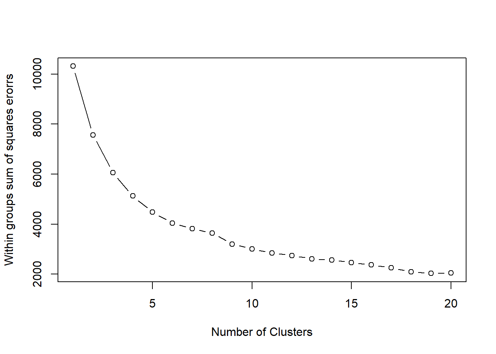
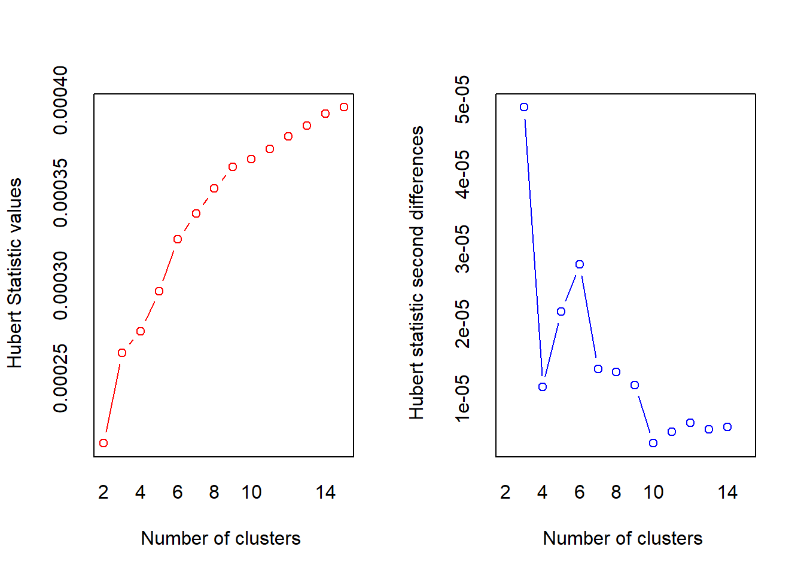
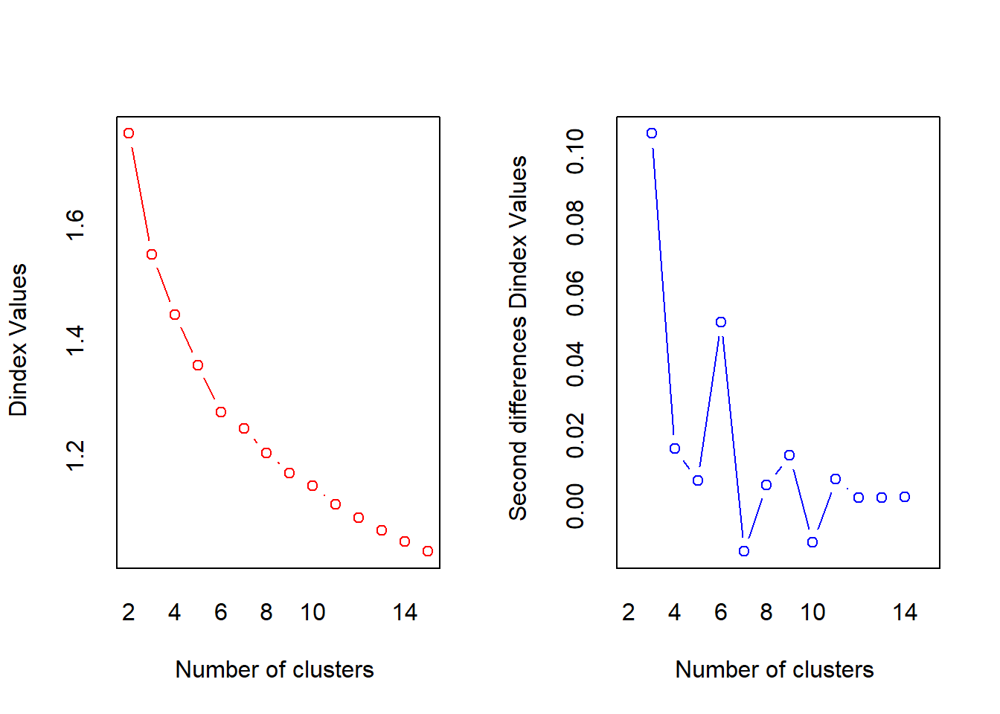
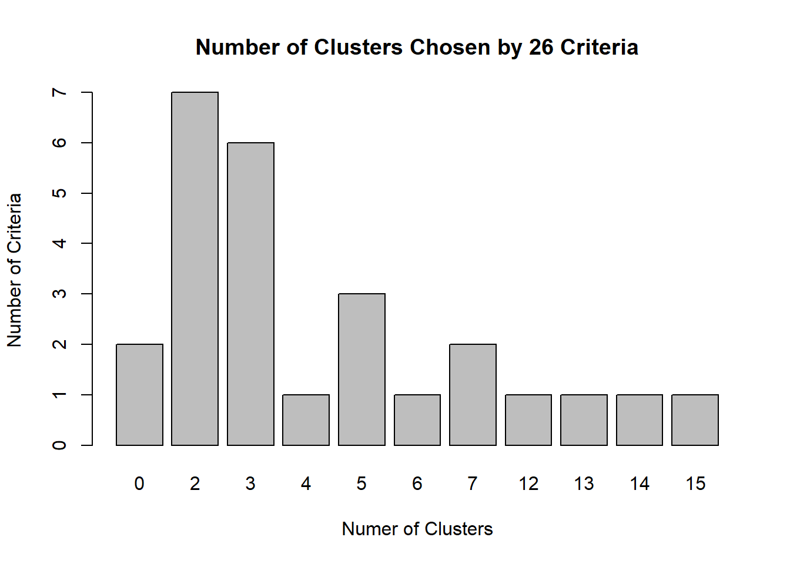
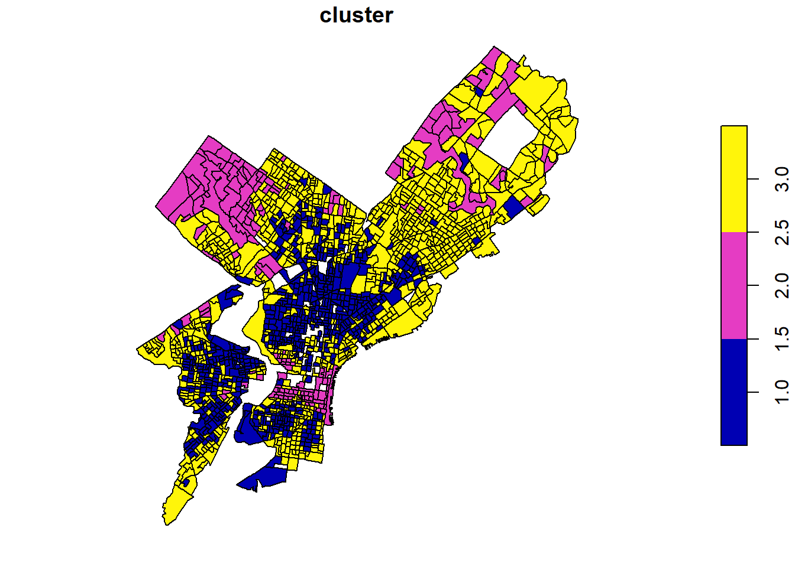

## Introduction

Clustering analysis helps us to identify if there is and (if so,) what kind of data clustering exist in a given data set. While it may not be the best method for exploring data, when we are dealing with large data set with more variables, clustering analysis help us partition it into smaller groups for further invesigation.

In this assignment, we intend to use K-Means clustering method, which is widely used for larger data sets and numeric variables, to examine clustering of the data set we used for project 1 and 2. K-means helps partition the data set into a number of non-overlapping clusters (k) set by researchers (us) prior. Given the data set we use having 5 variables, namely, **MEDHVAL, MEDHHINC, PCTBACHMOR, PCTSINGLES, PCTVACANT**, K-means clustering helps us identify if there is any clustering of the aggregated effect from the 5 variables. Furthermore, we will look at whether clustering of those five variables are spatially auto-correlated.

By applying K-means clustering, we can answer questions like how do we categorize and characterize all those house owners? How many classes are we able to identify from the given data and what are their characteristics? Together with spatial data, we can answer questions like are specific classes spatially clustered? How do we change the clustering and bring equity to the city through policy?


::: {.cell hash='musa-500-hmwk-5_cache/html/data and package import_e60e22511e874b610e975897dc3c9180'}

```{.r .cell-code}
#install.packages(c("NbClust","flexclust"))

library(NbClust)
library(flexclust)
library(dplyr)
library(kableExtra)
library(sf)
```
:::


## Methods

### 1. K-Means Algorithm

-  The first step is for researchers to determine the intented number of clusters (k). While researchers can come up with a random k, there exists some method for choosing the best number of clusters. In R, the NbClust package helps. In this project, we will utilize this package for generating a Scree Plot of the Sum of Squared Errors (SSE) within each group, given a certain number of clusters.
2.  Then comes a iterative process of improving the clustering assignment / identification, until there is no change in clustering membership (each data point is assigned to particular clustering center and no further change), or there after a set number of iterations. The process include:
    1.  Identify K data points as centers for each cluster (usually random guesses)
    2.  Assign each data point to a cluster by calculating their Euclidean distance to cluster centers and choosing the closest cluster center.
    3.  Given the assigned clusters with data points, recalculate new cluster centers for each cluster, which goes back to step 1 in the iterative process, or if there is no reassignment or after certain number of iteration, the process ends here.
3.  The cluster centers and the clustering assignments of data points can be informative for clustering analysis.

\*note that in this assignment, since we are looking at five different variables, we ensure that all data operates on the same scale before proceeding to K-means clustering and analysis.

### 2. Limitations of K-Means

1.  **Specify K-means in Advance** -- As mentioned above, for K-means, there is a necessity for researchers to identify the number of clusters (k) in advance. Although this is a limitation to k-means, there are methods to find the ideal k, one of them is referring to a SSE Scree Plot mentioned earlier.
2.  **(Technically) Numeric Data Only** -- K-means are technically only for numeric data with a sizable data set, though some use it for binary data as well.
3.  **Encountering Problems With Clusters of Different Sizes, Densities, Clusters of Non-Globular Shapes --** K-means clustering assumes clusters to be of the same size (same number of data points getting assigned to each cluster / cluster center), same density (which impacts the distance to closest cluster centers), and the clusters to be of a globular shapes (not following a particular non-globular pattern). Hence, any deviance from any of those assumptions may lead to problems when implementing K-means.
4.  **Inability to Handle Noises and Outliers** -- since each and every data point is going to be assigned to one of the clusters, the noises and outliers in the data set will be inevitably assigned to a cluster, making the clusters deviant from an ideal arrangement and messing up the clustering results.
5.  **K-means might attempt to find local minimum instead of global minimum, sometimes resulting incorrect solution**

### 3. Other Available Clustering Algorithms

Some other clustering methods include hierarchy clustering and DBSCAN (Density-Based Clustering). However, in comparison to the other two, K-means seems to be the most appropriate choice. Hierarchy Clustering is better suited for smaller data set, ideally under hundreds. Since this data set contains 1,720 data points, it may be too big for hierarchy clustering. Moreover, there is no particular reason why DBSCAN is necessarily more appropriate in this case.

## Results

### **1.  NbClust & SSE Scree Plot: Optimal Number of Clusters (k)**

The first scree plot shows SSE (Sum of Sqaured errors) of each number of clusters from 1 to 20. In the graph below, there is a distinct drop of SSE, when cluster moves from 1 to 3. After four clusters, rate of decreasing drops off, suggesting that 3-cluster solution is likely to be a good option to our data.

Given NbClust's ability to use different methods to seek for the ideal number of clusters, we have also plotted the number of clusters suggested using 26 criteria. From this plot, we can see that 2 and 3 clusters are most frequently suggested, yet in this situation, having only 2 clusters will not help with further analysis. Hence, our choice of 3 clusters seem appropriate.


::: {.cell hash='musa-500-hmwk-5_cache/html/scree plot and criteria_ba858b6596a64c8c1f90958e1cfcec52'}

```{.r .cell-code}
regression <- read.csv("https://github.com/nlebovits/musa-500-hmwk-5/raw/main/data/RegressionData.csv") 
data <- read.csv("https://github.com/nlebovits/musa-500-hmwk-5/raw/main/data/RegressionData.csv") 
data <- data %>% select(-POLY_ID, -AREAKEY) 
data <- scale(data)

data_see <- (nrow(data)-1)*sum(apply(data,2,var))

#nrow(data)-1
#apply(data,2,var)

kmeans(data, centers=2)
for (i in 2:20) data_see[i] <- sum(kmeans(data, centers=i)$withinss)

#data_see

plot(1:20, data_see, type="b", xlab="Number of Clusters",
     ylab="Within groups sum of squares erorrs")
```

::: {.cell-output-display}
{width=672}
:::

```{.r .cell-code}
set.seed(100)
nc <- NbClust(data, min.nc=2, max.nc=15, method="kmeans", index="all")
```

::: {.cell-output-display}
{width=672}
:::

::: {.cell-output-display}
{width=672}
:::

```{.r .cell-code}
#table(nc$Best.n[1,])

par(mfrow=c(1,1)) 
barplot(table(nc$Best.n[1,]),
        xlab="Numer of Clusters", ylab="Number of Criteria",
        main="Number of Clusters Chosen by 26 Criteria")
```

::: {.cell-output-display}
{width=672}
:::
:::


### **2. Three Clusters, Five Variables**


::: {.cell hash='musa-500-hmwk-5_cache/html/aggregated value_44a181fb22e365fc9be20d22959ff24b'}

```{.r .cell-code}
set.seed(1234)
fit.km <- kmeans(data, 3, nstart=1000)

fit.km$size
round(fit.km$centers, 2)
fit.km$cluster

cluster_info = as.data.frame(fit.km$cluster)

table <- cbind(round(aggregate(data, by=list(cluster=fit.km$cluster), mean),1),fit.km$size)
 
colnames(table)[1] = c("CLUSTER")
colnames(table)[8] = c("SIZE")
```
:::

::: {.cell hash='musa-500-hmwk-5_cache/html/aggregated value2_a7236bc639051873a62e8af232a5ea5f'}

```{.r .cell-code}
table <- table[, c(1, 8, 2, 3, 4, 5, 6, 7)]
  
table %>%
  kbl() %>%
  kable_paper("hover", full_width = F)
```

::: {.cell-output-display}
`````{=html}
<table class=" lightable-paper lightable-hover" style='font-family: "Arial Narrow", arial, helvetica, sans-serif; width: auto !important; margin-left: auto; margin-right: auto;'>
 <thead>
  <tr>
   <th style="text-align:right;"> CLUSTER </th>
   <th style="text-align:right;"> SIZE </th>
   <th style="text-align:right;"> MEDHVAL </th>
   <th style="text-align:right;"> PCTBACHMOR </th>
   <th style="text-align:right;"> MEDHHINC </th>
   <th style="text-align:right;"> PCTVACANT </th>
   <th style="text-align:right;"> PCTSINGLES </th>
   <th style="text-align:right;"> NBELPOV100 </th>
  </tr>
 </thead>
<tbody>
  <tr>
   <td style="text-align:right;"> 1 </td>
   <td style="text-align:right;"> 651 </td>
   <td style="text-align:right;"> -0.5 </td>
   <td style="text-align:right;"> -0.5 </td>
   <td style="text-align:right;"> -0.7 </td>
   <td style="text-align:right;"> 0.8 </td>
   <td style="text-align:right;"> -0.2 </td>
   <td style="text-align:right;"> 0.7 </td>
  </tr>
  <tr>
   <td style="text-align:right;"> 2 </td>
   <td style="text-align:right;"> 159 </td>
   <td style="text-align:right;"> 2.0 </td>
   <td style="text-align:right;"> 2.2 </td>
   <td style="text-align:right;"> 1.6 </td>
   <td style="text-align:right;"> -0.7 </td>
   <td style="text-align:right;"> 1.5 </td>
   <td style="text-align:right;"> -0.6 </td>
  </tr>
  <tr>
   <td style="text-align:right;"> 3 </td>
   <td style="text-align:right;"> 910 </td>
   <td style="text-align:right;"> 0.0 </td>
   <td style="text-align:right;"> 0.0 </td>
   <td style="text-align:right;"> 0.2 </td>
   <td style="text-align:right;"> -0.5 </td>
   <td style="text-align:right;"> -0.1 </td>
   <td style="text-align:right;"> -0.4 </td>
  </tr>
</tbody>
</table>

`````
:::
:::


Overall, the clustering makes sense across the 5 variables. We can see that cluster group 1 has the lowest house value, percentage of bachelor's degree, median household income, and percentage of single family houses, as well as highest percentage of vacant house and poverty rate out of all cluster group. Cluster group 2 is the opposite, and group 3 falls in between. The clustering shows socio-economic characteristics of each cluster groups, and taking everything into consideration, we came up with the following group names:

- Group 1: Lower Income
- Group 2: Bougie Communiti
- Group 3: Middle Class

### **3. Spatial Distribution of Clusters** 


::: {.cell hash='musa-500-hmwk-5_cache/html/Spatial Distribution of Clusters_4949887b59ebdf4a6eb071602d2ef2bc'}

```{.r .cell-code}
Regression_cluster <- cbind(regression, cluster_info)

regression_shp <- st_read("C:/Users/vestalk/Desktop/00_Upenn/20.Fall/03.MUSA 5000 Spatial Statistics and Data Analysis/Assignment/HW 5/RegressionData.shp") 

#regression_shp <- st_read("/Users/annzhang/Downloads/HW 5/RegressionData.shp") 

regression_shp <- left_join(regression_shp, Regression_cluster, by = "POLY_ID") %>% st_as_sf()

regression_cluster <- regression_shp %>% mutate(cluster = fit.km$cluster) %>% dplyr::select(cluster)

plot(regression_cluster)
```

::: {.cell-output-display}
{width=672}
:::
:::


By plotting the three cluster groups on 5 variables on a map (as shown above), we can see some patterns of spatial auto-correlation. There seems to be spatial clustering of cluster group 2 (higher income, more educated communities) in some parts of the center city, the north western part of the city, and some parts in the north-eastern areas, and clustering of group 1 (lower income) in the area north to the center city and some parts of West Philly. Since the clustering areas are not concentrated, it is difficult to rename the clusters by geographic locations.

## Discussion

To sum up, we used K-Means clustering on 5 variables and created three cluster groups representing three socio-economic groups and their respective house value. The clustering does a relatively good job in identifying clusters. Although none of the findings are surprising, the map in result section examines the spatial clustering of the cluster groups we created shows a spatial autocorrelation.

